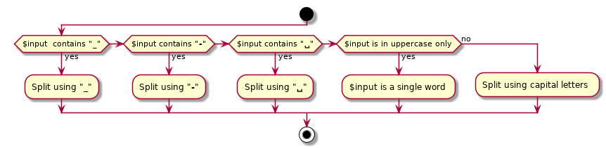

Detection algorithm
===================

When `\Jawira\CaseConverter\Convert` class is instantiated, the input string 
is analysed to detect the words in it.  

1. If input string contains `_` (underscore character), then `_` is used to split string.
2. If input string contains `-` (dash character), then `-` is used to split string. 
3. If input string contains `␣` (space character), then `␣` is used to split string. 
4. If input string contains uppercase characters only, then the input string is
considered to be a single word.
5. Finally, uppercase characters are used to split string.
