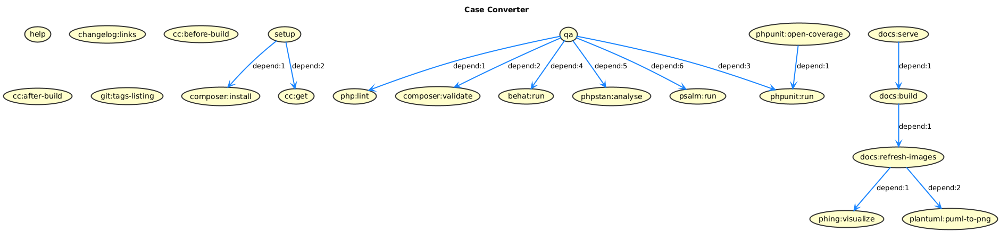

Development
===========

Phing targets
-------------

- `$ phing setup`: Prepare project for development.
- `$ phing qa`: Run quality tests, use this before every commit.
- `$ phing refresh`: Update generated files (changelog, images, etc).

Dev requirements
----------------

To use Phing tasks you need to previously install:

- [Phive]
- [mkdocs]

Using Phing behind a proxy
--------------------------

If you are developing behind a proxy, you have to set the environment 
variable `http_proxy`. This variable is imported in buildfile.

Conventions
-----------

This project adheres to:

- [git-flow]
- [Semantic Versioning]
- [Keep a changelog]
- [pds/skeleton]

[git-flow]: https://github.com/petervanderdoes/gitflow-avh
[Keep a changelog]: http://keepachangelog.com/en/1.0.0/
[mkdocs]: https://www.mkdocs.org/#installation
[pds/skeleton]: https://github.com/php-pds/skeleton
[Phive]: https://phar.io/
[Semantic Versioning]: http://semver.org/
