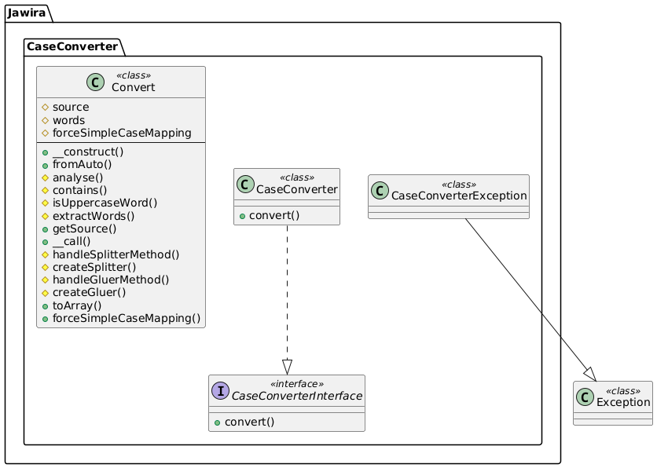
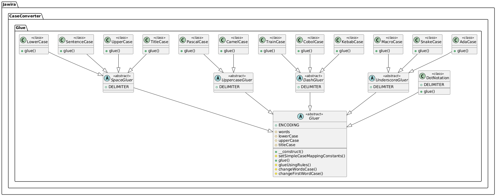
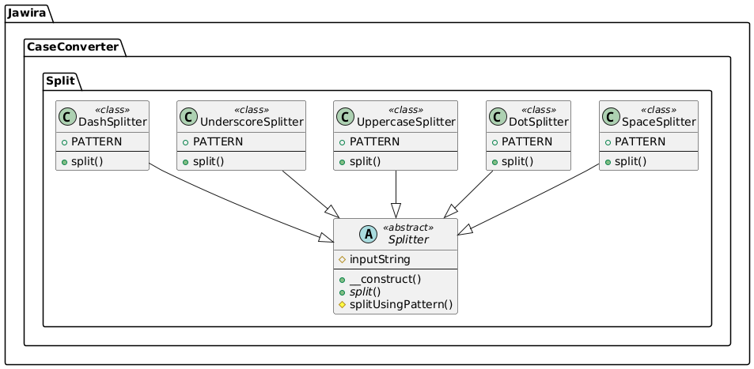

Development notes
=================

Phing targets
-------------

- `$ phing setup`: Prepare project for development.
- `$ phing qa`: Run quality tests, use this before every commit.

Dev requirements
----------------

To use Phing tasks you need to previously install:

- [Phive]
- [mkdocs]
- [mkdocs-material]
- [Composer]

Using Phing behind a proxy
--------------------------

If you are developing behind a proxy, you have to set the environment 
variable `http_proxy`. This variable already is imported in `build.xml`, so you
have nothing to do.

Conventions
-----------

This project adheres to:

- [git-flow]
- [Semantic Versioning]
- [Keep a changelog]
- [pds/skeleton]

Creating new convention
-----------------------

1. Create new Gluer class
2. Create new split car
3. Update `\Jawira\CaseConverter\Convert::analyse` if needed
4. Register into `\Jawira\CaseConverter\Convert::handleSplitterMethod`
5. Register into `\Jawira\CaseConverter\Convert::handleGluerMethod`
6. Update docblock `\Jawira\CaseConverter\Convert` to register new methods.
7. Update documentation

Railroad diagram
----------------

- <https://tabatkins.github.io/railroad-diagrams/generator.html>

Class diagrams
--------------

[git-flow]: https://github.com/petervanderdoes/gitflow-avh
[Keep a changelog]: http://keepachangelog.com/en/1.0.0/
[mkdocs]: https://www.mkdocs.org/#installation
[mkdocs-material]: https://github.com/squidfunk/mkdocs-material
[pds/skeleton]: https://github.com/php-pds/skeleton
[Phive]: https://phar.io/
[Semantic Versioning]: http://semver.org/
[Composer]: https://getcomposer.org/
