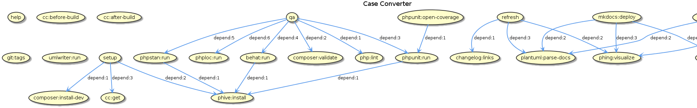

Development
===========

Phing targets
-------------

- `$ phing setup`: Prepare project for development.
- `$ phing qa`: Run quality tests, use this before every commit.
- `$ phing refresh`: Update generated files (changelog, images, etc).

Using proxy behind a Phing
--------------------------

If you are developing behind a proxy, you have to set the environment 
variable `http_proxy`. This variable is imported in buildfile.

Conventions
-----------

This project adheres to:

- [git-flow](https://github.com/petervanderdoes/gitflow-avh)
- [Semantic Versioning](http://semver.org/)
- [Keep a changelog](http://keepachangelog.com/en/1.0.0/)
- [pds/skeleton](https://github.com/php-pds/skeleton)
