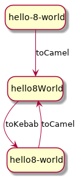

Known issues
============

Number handling
---------------

When using `case-converter` you cannot use a number as separator. In practice 
this means that a number is not considered as a word: 



As shown in the previous example, there is no way to go back to the original 
input string (i.e. `hello-8-world`), in _kebab case_ this sting is written as 
`hello8-world`.  

Full case-mapping
-----------------

PHP 7.3 introduced [Full Case-Mapping], in practice this means than you can 
have different results depending on your PHP version.

```php
$german = new Convert('Straße');

echo $german->toUpper();
// Produces STRAßE on PHP 7.2
// Produces STRASSE on PHP 7.3
```

Internally `Case-Converter` uses [mb_convert_case()], this function uses the 
following constants:

- MB_CASE_LOWER
- MB_CASE_TITLE
- MB_CASE_UPPER

The problem is that, Before _PHP 7.3_, these constants perform simple 
case-mapping and after _PHP 7.3_ perform full case-mapping.

If you want to maintain the old functionality after _PHP 7.3_ you have to call 
`->forceSimpleCaseMapping()`:

```php
// German
$ger = new Convert('Straße');
$ger->forceSimpleCaseMapping();
echo $ger->toUpper();    // output: STRASSE
```

----

IMHO this is a _breaking change_, PHP people should have keep untouched old 
constants and create new ones for [full case-mapping], for example: 
`MB_CASE_LOWER_FULL`, `MB_CASE_TITLE_FULL`, and `MB_CASE_UPPER_FULL` (please 
note these variables do not exist). 

[Full Case-Mapping]: https://www.php.net/manual/en/migration73.new-features.php#migration73.new-features.mbstring.case-mapping-folding
[mb_convert_case()]: https://www.php.net/manual/en/function.mb-convert-case.php
